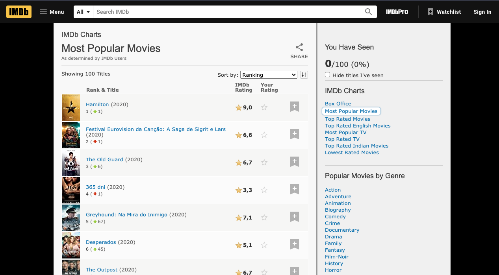

# Most Popular Movies Spider
<p align="left">
  

  
  
  <a href="https://github.com/Relirk/movies-webcrawler-spider/commits/master">
    
  </a>

  <a href="https://github.com/Relirk/movies-webcrawler-spider/issues">
    
  </a>

  
</p>

:electric_plug: This project captures all the best rated films on the [IMDb website](https://www.imdb.com/chart/moviemeter).

### 



### Tools used:
- [NodeJS](https://nodejs.org/en/)
- [Cheerio](https://github.com/cheeriojs/cheerio)
- [Nodemon](https://nodemon.io/)
- [Axios](https://github.com/axios/axios)

### Running Locally
```sh
# Install dependencies
yarn install

# Start the app on a new window
yarn start
```

### How it works?
Once the initialization command is executed, all the output will be in the imdb.txt file in .json format.

